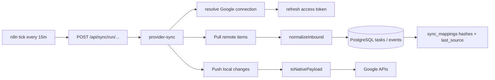
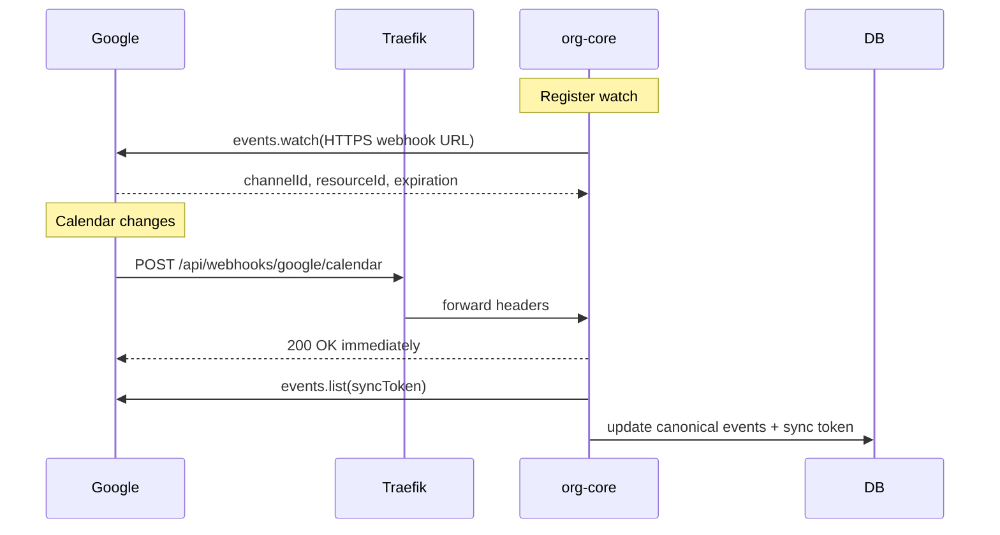

# Organization system design finalization
_Exported on 6/16/2026 at 20:29:00 GMT+10 from Cursor (3.5.33)_

---

**User**

I'm trying to make an organization system. 
The original design spec is in the file original-design-spec.txt . 
A more concise design spec is in finalized-design-spec.md . 
We got thought a series of iterations but some of the content got lost along the way.
The iterations are in the following directories, created in the following order: org-system-scaffold.zip, org-system-stage2.zip, org-system-stage3.zip, org-system-stage4.zip, org-system-code-complete-prototype.zip, org-system-deep-prototype.zip, org-system-merged-bundle.zip .

I'd like to finish the system.

---

**Cursor**

I'll start by reading both design specs and mapping what's in each iteration directory so we can see what's built and what was lost.


Reviewing audit findings and the recovered baseline to determine what's missing.


Exploring the recovered baseline and merge recovery tooling to assess completeness.


Comparing the recovered baseline with the richest iteration bundles to identify gaps.


Phase 1: making the recovered baseline runnable by pulling missing pieces from the other bundles.


Creating consolidated `org-system` from the recovered baseline and merging missing pieces from the iteration bundles.


Writing missing service files directly since the directory copy didn't fully apply.


Your iteration bundles split the work across stages, and content was lost when later bundles overwrote or omitted pieces from earlier ones. No single bundle is complete or runnable on its own.

## What the audit found

| Bundle | Strength | Critical gap |
|--------|----------|--------------|
| **scaffold** | Full infra, docs, compose with HA/Node-RED | Minimal org-core logic |
| **stage2–3** | DB CRUD, expanded APIs | stage3 missing migrations on disk |
| **stage4** | Sync, audit, adapters, full schema | No HTTP server; config-ui/eink are README stubs |
| **code-complete** | Runnable routes | No database layer (stub responses) |
| **deep-prototype** | Google/HA integrations, routes | No migrations |
| **merged-bundle** | Attempted merge | Incomplete; broken compose references |

The prior `org-system-recovered-baseline` had the richest domain layer but was **not runnable** — it was missing `app/server.js`, `app/routes.js`, and real config-ui/eink-client implementations.

## What I built: `org-system/`

There is now a consolidated tree at [`org-system/`](c:\Users\skirm\OneDrive\Documents\git\organizer\org-system) that merges the best parts:

- **From stage4 / recovered baseline** — migrations, sync layer, adapters, audit, CRUD APIs, n8n workflows
- **From deep prototype** — HTTP app wiring (`server.js`, `routes.js`), provider-sync and service-connections APIs
- **From stage3** — config-ui and e-ink-client (PC preview pulling org-core display payload)
- **From scaffold** — full Docker Compose with Home Assistant, optional Node-RED, postgres init, n8n volumes

Additional fixes applied:

- Compensating **undo** for tasks and calendar (create/delete/update with before/after audit snapshots)
- Migration `009_undo_status.sql` for undo entry status tracking
- Updated [`docs/bundle-status.md`](c:\Users\skirm\OneDrive\Documents\git\organizer\org-system\docs\bundle-status.md) with an honest gap list vs the design spec

### Quick start

```bash
cd org-system
cp .env.example .env
docker compose up -d --build
```

## Still to finish (vs `finalized-design-spec.md`)

The consolidated tree is a **runnable foundation**, not the full system yet:

1. **Provider sync loops** — Google/Bring adapters exist but aren't wired to live pull/push reconciliation
2. **Advanced recurrence** — after-completion, weekday rules, end conditions
3. **Reminder execution** — re-remind and notify-before scheduling
4. **Report delivery** — voice output, presence gating, timed triggers
5. **Web-mode config UI** — service connection editing in the database
6. **Presence adapter**, linked-items API, hardware e-ink path

Details are in [`org-system/docs/bundle-status.md`](c:\Users\skirm\OneDrive\Documents\git\organizer\org-system\docs\bundle-status.md).

---

Where would you like to go next? I can prioritize in this order if you want to keep moving:

1. **Wire Google Tasks/Calendar sync** (connect adapters + integration APIs + n8n tick)
2. **Extend the recurrence engine** to match the YAML metadata spec
3. **Bring up the stack locally** and smoke-test CRUD, undo, display preview
4. **Something else** — e.g. Alexa/barcode intake, reports, or config UI

Tell me which area matters most and I'll continue from there.

---

**User**

Wire Google Tasks/Calendar sync (connect adapters + integration APIs + n8n tick)

---

**Cursor**

I'll trace the existing Google adapters, integration APIs, provider-sync entry point, and the n8n sync tick so we can wire them together end-to-end.


Implementing the sync orchestrator and supporting modules: connection resolution, mapping helpers, adapter outbound payloads, and API update methods.


Google Tasks and Calendar sync is wired end-to-end. Here is what was added and how to use it.

## Sync architecture



Each poll run:

1. **Pull** — fetch Google Tasks/Calendar items, normalize via adapters, create/update canonical rows, track `native_hash` / `metadata_hash`
2. **Conflict** — if both sides changed, most-recently-updated wins (per design spec)
3. **Push** — export canonical items with no mapping, or local changes since last sync, back to Google

## New / updated code

| Module | Role |
|--------|------|
| `src/sync/google/tasks-sync.js` | Tasks pull/push loop |
| `src/sync/google/calendar-sync.js` | Calendar pull/push loop |
| `src/sync/google/resolve-connection.js` | Load credentials from env or `service_connections` |
| `src/sync/util/hash.js` | Change detection hashes |
| `src/api/provider-sync/index.js` | Dispatches sync + batch endpoint |
| Adapters | Added `toNativePayload()`; fixed task status mapping |
| Google APIs | Added `updateGoogleTask` / `updateGoogleCalendarEvent` |
| `sync-mappings` repo | Lookup + upsert helpers |

## API endpoints

```bash
# Tasks only
curl -X POST http://localhost:8080/api/sync/run/google-tasks \
  -H "Content-Type: application/json" -d '{"mode":"poll"}'

# Calendar only
curl -X POST http://localhost:8080/api/sync/run/google-calendar \
  -H "Content-Type: application/json" -d '{"mode":"poll"}'

# Both
curl -X POST http://localhost:8080/api/sync/run/google/all \
  -H "Content-Type: application/json" -d '{"mode":"poll"}'
```

Response includes stats: `{ pulled, pushed, skipped, errors }`.

## Configuration

Set in `.env` (see `env-templates/providers.env.example`):

```env
GOOGLE_CLIENT_ID=...
GOOGLE_CLIENT_SECRET=...
GOOGLE_REFRESH_TOKEN=...
GOOGLE_TASK_LIST_IDS=          # optional; defaults to all lists
GOOGLE_CALENDAR_IDS=primary    # optional; defaults to primary
```

Or create an enabled row via `POST /api/services/connections`:

```json
{
  "providerId": "google-tasks",
  "providerType": "tasks",
  "enabled": true,
  "config": {
    "refreshToken": "...",
    "taskListIds": ["your-list-id"]
  }
}
```

## n8n workflows

| Workflow | Action |
|----------|--------|
| `google/google_tasks_sync_tick.json` | Tasks sync every 15 min |
| `google/google_calendar_sync_tick.json` | **new** — Calendar sync |
| `google/google_sync_all_tick.json` | **new** — both providers |
| `reconciliation/task_reconciliation_tick.json` | **updated** — runs batch sync, then loads mappings |

Import these into n8n after starting the stack.

## Limits (for now)

- Poll mode only (no Google push notifications/webhooks yet)
- New tasks push to the **first** configured task list; new events push to the **first** calendar
- Sync writes go directly to repos (no audit/undo entries for sync-driven changes)
- Metadata blocks round-trip through task notes / event descriptions
- Bring, Keep, and cross-provider shopping sync are not connected yet

Once you have Google OAuth credentials in place, run the batch endpoint or enable the n8n tick to exercise the loop. If you want next steps, I can wire Bring via Home Assistant or add sync audit logging.

---

**User**

what is needed to enable google push notifications/webhooks?

---

**Cursor**

I'll check what's already in the codebase for Google push/webhooks and how the stack exposes public endpoints.


---

**User**

can we finish google push notifications/webhooks if there's nothing blocking it

---

**Cursor**

Implementing Google Calendar push notifications — Calendar supports watch channels; Tasks doesn't, so Tasks will stay on polling. Reviewing the sync and routing setup first.


Implementing Google Calendar push via the Calendar API watch channels. Tasks has no push API, so it stays on polling.


Fixing the watch module and simplifying calendar sync to avoid duplicate API calls.


Google Calendar push is implemented. **Google Tasks push is not possible** — the Tasks API has no watch/webhook mechanism, so Tasks continues to use the existing 15-minute poll via n8n.

## What was built

### Google Calendar push (complete)

1. **Watch channel storage** — migration `010_google_calendar_watch.sql` tracks channel ID, resource ID, expiration, sync token, and webhook token per calendar.

2. **Registration API**
   ```bash
   POST /api/sync/watch/google-calendar/register
   POST /api/sync/watch/google-calendar/renew      # renew channels expiring within 24h
   GET  /api/sync/watch/google-calendar            # list active channels
   ```

3. **Webhook receiver**
   ```bash
   POST /api/webhooks/google/calendar
   ```
   - Responds immediately with `200` (Google requires a fast ack)
   - Verifies `X-Goog-Channel-Token`
   - Runs incremental pull using stored `syncToken` in the background
   - Handles deletions (`cancelled` events)

4. **n8n renewal workflow** — `n8n/workflows/google/google_calendar_watch_renew_tick.json` (every 12 hours)

### Google Tasks (unchanged — poll only)

Keep using:
```bash
POST /api/sync/run/google-tasks
```
or the existing `google_tasks_sync_tick` n8n workflow.

## Setup steps

1. **Public HTTPS URL** — Google will not deliver to HTTP or localhost. Your Traefik route already exposes `/api/*`, so the default webhook URL is:
   ```
   https://andrewjscott.net/api/webhooks/google/calendar
   ```
   Or set `GOOGLE_CALENDAR_WEBHOOK_URL` explicitly.

2. **Shared secret** in `.env`:
   ```env
   GOOGLE_CALENDAR_WEBHOOK_TOKEN=your-long-random-secret
   ORGSYS_DOMAIN=andrewjscott.net
   GOOGLE_REFRESH_TOKEN=...
   ```

3. **Register watches** (after stack is up and credentials work):
   ```bash
   curl -X POST https://andrewjscott.net/api/sync/watch/google-calendar/register \
     -H "Content-Type: application/json" -d '{}'
   ```

4. **Enable renewal** — import `google_calendar_watch_renew_tick.json` into n8n (channels expire after ~7 days).

5. **Keep Tasks polling** — import/enable `google_tasks_sync_tick.json` or `google_sync_all_tick.json` for Tasks + Calendar poll backup.

## Flow



## What’s still not covered

- **Tasks push** — blocked by Google; no API for it
- **Outbound push on webhook** — webhook-triggered sync is pull-only (avoids sync loops when org-core writes to Google)
- **TLS termination** — must work on your public domain before registration will succeed
- **Local dev** — needs a tunnel (ngrok, etc.) unless you test poll sync only

Full setup notes are in [`org-system/docs/real-service-setup.md`](c:\Users\skirm\OneDrive\Documents\git\organizer\org-system\docs\real-service-setup.md).

